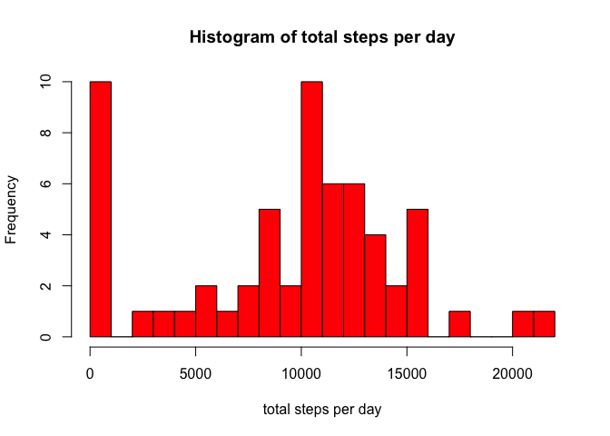
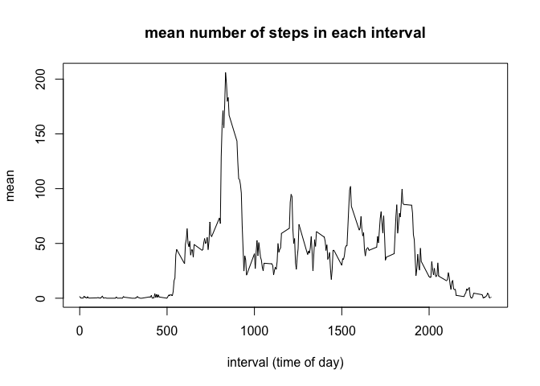
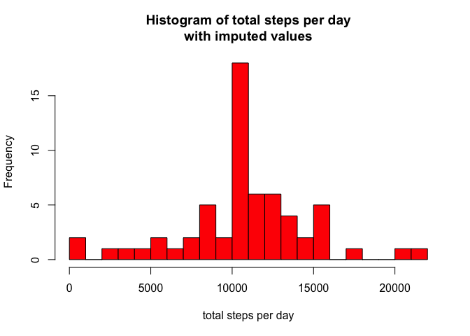
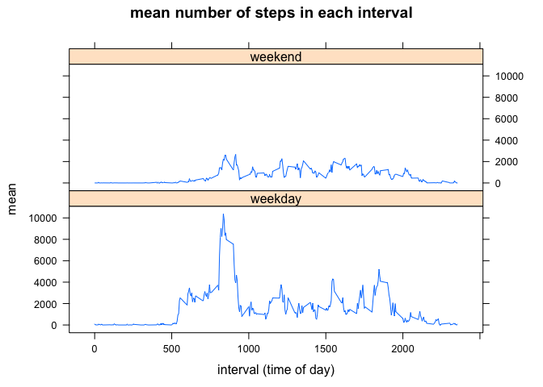

# Reproducible Research: Peer Assessment 1

In this project, we analyse data from a personal activity monitoring device. This device collects data at 5 minute intervals through out the day. The data consists of two months of data from an anonymous individual collected during the months of October and November, 2012 and include the number of steps taken in 5 minute intervals each day.

## Loading and preprocessing the data

The data is stored in a zip file provided with this git repository, so we unpack it using `zip`, and load it using `read.csv()`.


```r
library(dplyr); library(knitr); library(lattice)
if (!file.exists("./activity.csv")) { unzip('./activity.zip'); }
activity <- read.csv("./activity.csv", colClasses = c("numeric","POSIXct","numeric"))  
```

Each observation is a step count within a 5-minute interval, the day, and the time, expressed as a 24-hour time. For `35` represents `0035`, or 12:35am, and `2355` represents 11:55pm.


        steps  date          interval
-----  ------  -----------  ---------
2464        0  2012-10-09        1315
2465        0  2012-10-09        1320
2466        0  2012-10-09        1325
2467      247  2012-10-09        1330
2468      196  2012-10-09        1335
2469      108  2012-10-09        1340

## What is the average daily activity pattern?

we can take our five-minute interval reading and combine them into daily step counts, a mean, and a median. We use this to show the distribution of different step counts. (Note that in the calculations below, missing values are treated as zero, which will under-represent the total number of steps taken.)


```r
stepsPerDay <- activity %>%
    group_by(date) %>%
    summarise(totalStepsPerDay = sum(steps, na.rm = TRUE)) %>%
    mutate(totalStepsPerDay = ifelse(is.na(totalStepsPerDay), 0, totalStepsPerDay))

hist(stepsPerDay$totalStepsPerDay, 
     col = "red", 
     breaks = 20, 
     main = "Histogram of total steps per day", 
     xlab = "total steps per day")
```

<!-- -->

```r
medianTotalStepsPerDay <- median(stepsPerDay$totalStepsPerDay)
meanTotalStepsPerDay <- mean(stepsPerDay$totalStepsPerDay)
```

We notice from this that there are two peaks - one at zero, which probably represents the days where the device was not used, and another peak at the **median value of 10395 steps per day**. We will see the significance of this peak later in the analysis. The mean is **9354 steps per day**. 

What does the pattern look like over the course of a day? We can plot the average number of steps taken in any 5-minute period. Again, note that these numbers are lower than reality. 


```r
fiveMinuteIntervals <- activity %>%
    group_by(interval) %>%
    summarise(mean = mean(steps,na.rm = TRUE))

plot(x = fiveMinuteIntervals$interval, 
     y=fiveMinuteIntervals$mean, 
     type="l", 
     main="mean number of steps in each interval", 
     xlab="interval (time of day)", 
     ylab="mean")
```

<!-- -->

Note that there is a clear peak in the morning; **this peak occurs at 835.** One theory might be that this represents the user walking to work in the morning. We will examine this theory a little later in the analysis.

## Imputing missing values

As mentioned earlier, the missing data in the dataset creates some problems. Missing values (representing times where the device is not recording) will bring down the average. There are **2304 missing recordings**, representing a total of 13.1%. To account for these missing values, we will replace missing values with something suitable. We have chosen to fill the missing slots in any interval with the mean value calcuated above.


```r
activityWithMeanValues <- activity %>% 
    dplyr::inner_join(fiveMinuteIntervals, by='interval') %>%
    mutate(imputedSteps = ifelse(is.na(steps), mean, steps)) %>%
    select(imputedSteps, date, interval)
```

This will have changed the data we saw before;


```r
stepsPerDayImputed <- activityWithMeanValues %>%
    group_by(date) %>%
    summarise(totalStepsPerDay = sum(imputedSteps, na.rm = TRUE)) %>%
    mutate(totalStepsPerDay = ifelse(is.na(totalStepsPerDay), 0, totalStepsPerDay))

hist(stepsPerDayImputed$totalStepsPerDay, 
     col = "red", 
     breaks = 20, 
     main = "Histogram of total steps per day\nwith imputed values", 
     xlab = "total steps per day")
```

<!-- -->

This will have changed the mean and median;


```r
meanTotalStepsPerDayImputed <- mean(stepsPerDayImputed$totalStepsPerDay)
medianTotalStepsPerDayImputed <- median(stepsPerDayImputed$totalStepsPerDay)
impactOnMean <- abs(meanTotalStepsPerDay - meanTotalStepsPerDayImputed) / meanTotalStepsPerDay
impactOnMedian <- abs(medianTotalStepsPerDay - medianTotalStepsPerDayImputed) / medianTotalStepsPerDay
```

Our new mean is **10766.19**, up 15.09% from 9354.23. Our new median is **10766.19**, up 3.57% from 10395.00.

## Are there differences in activity patterns between weekdays and weekends?

We conjectured earlier that maybe the spike in activity at 835, it might represent the user walking to work in the morning. If this theory is correct, we will see this peak strongly on Monday-Friday, and very much reduced on Saturday and Sunday. We can see this by categorising the data as 'weekday' or 'weekend', and plotting the different values;


```r
activityWithWeekdays <- activityWithMeanValues %>% 
    mutate(weekday = factor(ifelse(weekdays(date) %in% c("Saturday", "Sunday"), "weekend", "weekday"))) %>%
    group_by(weekday, interval) %>% 
    summarise(totalSteps=sum(imputedSteps))

xyplot(
    activityWithWeekdays$total ~ activityWithWeekdays$interval | activityWithWeekdays$weekday, type="l", 
    layout = c(1,2),    
    main="mean number of steps in each interval", 
    xlab="interval (time of day)", 
    ylab="mean")
```

<!-- -->
